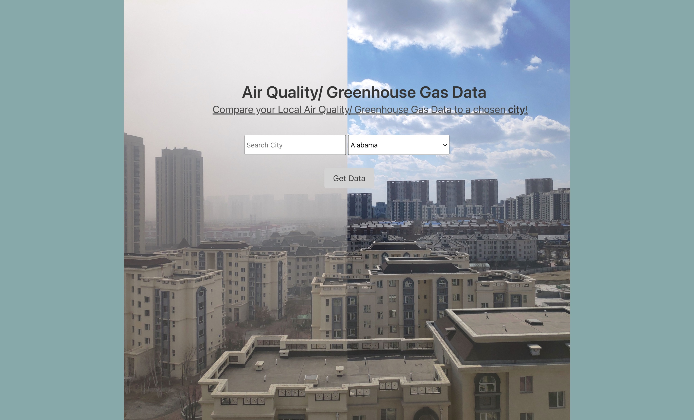
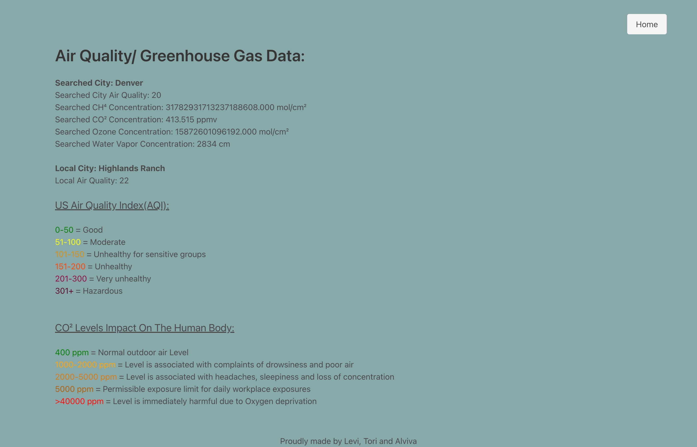

# Air Quality Comparison

## Description:

Air Quality Comparison is a user friendly application for relavant air quality data in specific locations. It allows the user to make a direct comparsion of their current location to another city of their choice. The data includes Air Quality Index (AQI) and greenhouse gases, including carbon dioxide, water vapor, methane, and ozone. The application also provides the normal range values of the environmental factors. The goal is to provide useful information to those who are concerned or curious about their air quality. 

### Technologies Used: 
- HTML
- Bulma
- Javascript
- Geolocation

### API's and Documentation:
- AirVisual (https://api-docs.iqair.com/?version=latest)
- Ambee (https://www.getambee.com/api-documentation)

## Mockup 

#### Home Page: 

#### Results Page: 

### Direction for Future Development:
- Create an interactive map feature to show geographical data that impacts air quality including wildfire locations, pollen count, and ground-level ozone
- Have a comparison of local data to national and global data
- Show the history of air quality over time based on specific location and globally
- Include information on health impacts due to poor air quality
- Provide user with the closest health care facilities if they are experiencing any symptoms

### Collaborators 
- Alviva Faidley
- Levi Heintzelman
- Tori Haling